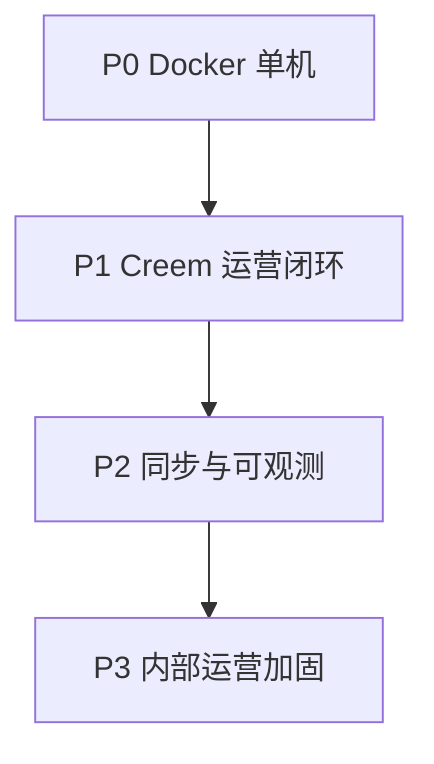

# Creem 深化 + Docker 单机部署 + 内部运营 Implementation Plan

> **For agentic workers:** REQUIRED SUB-SKILL: Use superpowers:subagent-driven-development (recommended) or superpowers:executing-plans to implement this plan task-by-task. Steps use checkbox (`- [ ]`) syntax for tracking.

**Goal:** 在不做多渠道的前提下，完成 Creem 支付闭环深化，并提供可一键启动的单机 Docker 部署，供内部运营团队日常使用。

**Architecture:** 保持模块化单体；Docker Compose 编排 `postgres` + `redis` + `api` + `web`（Nginx 反代静态与 `/api`）；Creem 能力集中在 `backend/internal/payment/provider/creem`，新增 Checkout/Refund API 调用与 Webhook 事件表驱动状态机；内部运营场景不开放商户 API，仅管理端 Cookie 会话。

**Tech Stack:** Go 1.22+ / Gin / GORM / PostgreSQL 15 / Redis 7 / React + Vite / Nginx / Docker Compose

## Global Constraints

- **支付渠道：** 仅深化 Creem，不新增 Stripe/PayPal/Adyen adapter
- **部署：** 先做 Docker Compose 单机；配置 12-factor 环境变量，为后续 K8s 留 `healthz`/`readyz`/无状态 API
- **用户范围：** 内部运营；不实现商户开放 API / API Key
- **i18n：** 新增 UI 壳层文案必须走 `src/locales/zh-CN/*.json`
- **鉴权：** HttpOnly Cookie；响应 JSON 不含 token；前端 `credentials: 'include'`
- **分支命名：** `cursor/<descriptive-name>-332e`

---

## 路线图总览

| 阶段 | 主题 | 交付物 | 优先级 |
|------|------|--------|--------|
| **P0** | Docker 单机部署 | `docker compose up` 一键可用 | 🔴 最先 |
| **P1** | Creem 运营闭环 | Sandbox 测试下单 → Webhook 落库 → 退款调 API | 🔴 |
| **P2** | Creem 同步与可观测 | 商品双向同步、Webhook 重放、渠道健康 | 🟡 |
| **P3** | 内部运营加固 | 登录限流、密钥加密、运维文档、CI | 🟡 |



---

## P0 — Docker 单机部署

> **目标：** `docker compose up -d` 后访问 `http://<host>:3000` 可登录管理端，API 经同源反代。

### P0 文件结构

| 文件 | 职责 |
|------|------|
| `docker-compose.yml` | 根编排：postgres / redis / api / web |
| `backend/Dockerfile` | 多阶段构建 Go API |
| `Dockerfile.web` | 多阶段构建 Vite 静态 + Nginx |
| `deploy/nginx.conf` | 反代 `/api` → `api:8080`，静态资源 |
| `.env.docker.example` | 生产/单机环境变量模板 |
| `docs/deploy/docker.md` | 部署与运维手册 |

### Task P0.1: 后端 Dockerfile

**Files:**
- Create: `backend/Dockerfile`
- Modify: `backend/.dockerignore`（若无则创建）

**Interfaces:**
- Produces: 镜像 `novaspay-api:latest`，监听 `:8080`，入口 `./api`

- [ ] **Step 1: 创建 `.dockerignore`**

```
bin/
*.test
.git
```

- [ ] **Step 2: 创建多阶段 `backend/Dockerfile`**

```dockerfile
# syntax=docker/dockerfile:1
FROM golang:1.22-alpine AS builder
WORKDIR /src
RUN apk add --no-cache git ca-certificates
COPY go.mod go.sum ./
RUN go mod download
COPY . .
RUN CGO_ENABLED=0 GOOS=linux go build -o /out/api ./cmd/api

FROM alpine:3.20
RUN apk add --no-cache ca-certificates tzdata curl
WORKDIR /app
COPY --from=builder /out/api ./api
EXPOSE 8080
HEALTHCHECK --interval=15s --timeout=3s --retries=5 \
  CMD curl -sf http://127.0.0.1:8080/healthz || exit 1
ENTRYPOINT ["./api"]
```

- [ ] **Step 3: 本地构建验证**

```bash
cd backend && docker build -t novaspay-api:test .
docker run --rm -p 18080:8080 \
  -e NOVAS_POSTGRES_DSN="host=host.docker.internal user=novas password=novas dbname=novaspay port=5433 sslmode=disable" \
  -e NOVAS_REDIS_ADDR="host.docker.internal:6380" \
  novaspay-api:test
# 另终端：curl http://127.0.0.1:18080/healthz
```

- [ ] **Step 4: Commit**

```bash
git add backend/Dockerfile backend/.dockerignore
git commit -m "build(docker): add multi-stage API image"
```

---

### Task P0.2: 前端 Nginx 镜像

**Files:**
- Create: `Dockerfile.web`
- Create: `deploy/nginx.conf`
- Modify: `vite.config.ts`（`preview`/`build` 的 `base` 保持 `/`）

**Interfaces:**
- Consumes: 构建产物 `dist/`
- Produces: 镜像 `novaspay-web:latest`，`:3000` 对外，反代 `/api` → `http://api:8080`

- [ ] **Step 1: 创建 `deploy/nginx.conf`**

```nginx
server {
  listen 3000;
  server_name _;
  root /usr/share/nginx/html;
  index index.html;

  location /api/ {
    proxy_pass http://api:8080;
    proxy_http_version 1.1;
    proxy_set_header Host $host;
    proxy_set_header X-Real-IP $remote_addr;
    proxy_set_header X-Forwarded-For $proxy_add_x_forwarded_for;
    proxy_set_header X-Forwarded-Proto $scheme;
  }

  location /healthz {
    proxy_pass http://api:8080/healthz;
  }

  location / {
    try_files $uri $uri/ /index.html;
  }
}
```

- [ ] **Step 2: 创建 `Dockerfile.web`**

```dockerfile
FROM node:22-alpine AS builder
WORKDIR /app
COPY package.json package-lock.json* ./
RUN npm ci
COPY . .
ENV VITE_API_BASE_URL=/api/v1
RUN npm run build

FROM nginx:1.27-alpine
COPY deploy/nginx.conf /etc/nginx/conf.d/default.conf
COPY --from=builder /app/dist /usr/share/nginx/html
EXPOSE 3000
```

- [ ] **Step 3: 构建验证**

```bash
docker build -f Dockerfile.web -t novaspay-web:test .
```

- [ ] **Step 4: Commit**

```bash
git add Dockerfile.web deploy/nginx.conf
git commit -m "build(docker): add web image with nginx api proxy"
```

---

### Task P0.3: 根目录 Compose 编排

**Files:**
- Create: `docker-compose.yml`（仓库根）
- Create: `.env.docker.example`
- Modify: `backend/internal/conf/config.go`（Docker 内默认 DSN 用服务名 `postgres`/`redis`）

**Interfaces:**
- Produces: `docker compose up -d` 四服务全部 healthy

- [ ] **Step 1: 创建 `.env.docker.example`**

```bash
# 复制为 .env 后 docker compose up
NOVAS_MODE=release
NOVAS_JWT_SECRET=change-me-in-production-use-openssl-rand
NOVAS_COOKIE_SECURE=false
NOVAS_CORS_ORIGINS=http://localhost:3000
SEED_DEMO=true
POSTGRES_USER=novas
POSTGRES_PASSWORD=novas
POSTGRES_DB=novaspay
```

- [ ] **Step 2: 创建根 `docker-compose.yml`**

```yaml
services:
  postgres:
    image: postgres:15-alpine
    environment:
      POSTGRES_USER: ${POSTGRES_USER:-novas}
      POSTGRES_PASSWORD: ${POSTGRES_PASSWORD:-novas}
      POSTGRES_DB: ${POSTGRES_DB:-novaspay}
    volumes:
      - pg_data:/var/lib/postgresql/data
    healthcheck:
      test: ["CMD-SHELL", "pg_isready -U novas -d novaspay"]
      interval: 5s
      retries: 10

  redis:
    image: redis:7-alpine
    healthcheck:
      test: ["CMD", "redis-cli", "ping"]
      interval: 5s
      retries: 10

  api:
    build:
      context: ./backend
      dockerfile: Dockerfile
    depends_on:
      postgres: { condition: service_healthy }
      redis: { condition: service_healthy }
    environment:
      NOVAS_MODE: ${NOVAS_MODE:-release}
      NOVAS_POSTGRES_DSN: host=postgres user=${POSTGRES_USER:-novas} password=${POSTGRES_PASSWORD:-novas} dbname=${POSTGRES_DB:-novaspay} port=5432 sslmode=disable TimeZone=UTC
      NOVAS_REDIS_ADDR: redis:6379
      NOVAS_JWT_SECRET: ${NOVAS_JWT_SECRET:-dev-change-me}
      NOVAS_COOKIE_SECURE: ${NOVAS_COOKIE_SECURE:-false}
      NOVAS_CORS_ORIGINS: ${NOVAS_CORS_ORIGINS:-http://localhost:3000}
      SEED_DEMO: ${SEED_DEMO:-true}
    ports:
      - "8080:8080"

  web:
    build:
      context: .
      dockerfile: Dockerfile.web
    depends_on:
      api: { condition: service_started }
    ports:
      - "3000:3000"

volumes:
  pg_data:
```

- [ ] **Step 3: `config.go` 支持 `SEED_DEMO`**

在 `migrations/apply.go` 或 `infra` 启动处读取 `SEED_DEMO`；`false` 时跳过演示租户/应用等种子（保留语言/菜单/超管）。

- [ ] **Step 4: 端到端验证**

```bash
cp .env.docker.example .env
docker compose up -d --build
curl -sf http://localhost:8080/healthz
curl -sf http://localhost:3000/healthz
# 浏览器 http://localhost:3000 登录 admin@novaspay.global / Admin@123456
```

- [ ] **Step 5: 编写 `docs/deploy/docker.md`**

包含：前置条件、首次启动、改密、备份 `pg_data`、升级镜像、常见问题。

- [ ] **Step 6: Commit**

```bash
git add docker-compose.yml .env.docker.example docs/deploy/docker.md
git commit -m "deploy: docker compose single-machine stack"
```

---

### Task P0.4: Makefile 与 README 更新

**Files:**
- Modify: `README.md`
- Create: `Makefile`（根目录，`make docker-up` / `make docker-down`）

- [ ] **Step 1: 根 Makefile**

```makefile
.PHONY: docker-up docker-down docker-logs
docker-up:
	docker compose up -d --build
docker-down:
	docker compose down
docker-logs:
	docker compose logs -f --tail=100
```

- [ ] **Step 2: README 增加 Docker 快速启动章节**

- [ ] **Step 3: Commit**

```bash
git commit -m "docs: add docker quick start to README"
```

---

## P1 — Creem 运营闭环（内部可跑通一笔 Sandbox 交易）

> **目标：** 运营可在管理端配置 Creem Sandbox 渠道 → 发起测试 Checkout → Webhook 自动落流水 → 发起退款并调 Creem API。

### P1 现状缺口

| 能力 | 现状 | 目标 |
|------|------|------|
| 测试下单 | 前端 `PaymentChannelsView` 仅生成 JSON，不调 API | `POST /payment-channels/:id/checkout-test` 返回 Creem checkout URL |
| 退款处理 | `ProcessRefund` 直接改库为 SUCCESS | 调 Creem Refund API，失败保留 PROCESSING |
| Webhook 事件 | 5 种事件 | 补 `subscription.canceled`、`payment.failed` 等 + 幂等表 |
| 渠道密钥 | 明文存库 | AES-GCM 加密（`NOVAS_DATA_KEY`） |

### Task P1.1: Creem Client 扩展

**Files:**
- Modify: `backend/internal/payment/provider/creem/client.go`
- Create: `backend/internal/payment/provider/creem/checkout.go`
- Create: `backend/internal/payment/provider/creem/refund.go`
- Test: `backend/internal/payment/provider/creem/checkout_test.go`

**Interfaces:**
- Produces:
  - `CreateCheckoutSession(ctx, CreateCheckoutReq) (*CheckoutSession, error)`
  - `CreateRefund(ctx, transactionID string, amountCents int64) (*RefundEntity, error)`
  - `ListProducts(ctx, page, pageSize) ([]ProductEntity, error)`

- [ ] **Step 1: 写 checkout 请求/响应 struct + 单测（mock HTTP）**

- [ ] **Step 2: 实现 `CreateCheckoutSession`**

Creem API（sandbox）路径参考：`POST /checkouts` 或文档等价端点；请求体含 `product_id`、`success_url`、`customer_email`（以 Creem 官方文档为准）。

- [ ] **Step 3: 实现 `CreateRefund`**

- [ ] **Step 4: `go test ./internal/payment/provider/creem/...`**

- [ ] **Step 5: Commit**

```bash
git commit -m "feat(creem): add checkout session and refund client"
```

---

### Task P1.2: 测试 Checkout API + 前端对接

**Files:**
- Modify: `backend/internal/payment/service/channel.go`
- Modify: `backend/internal/payment/handler/handler.go`
- Modify: `backend/internal/payment/module.go`
- Modify: `src/api/modules/channels.ts`
- Modify: `src/components/PaymentChannelsView.tsx`
- Modify: `src/locales/zh-CN/payments.json`

**Interfaces:**
- Produces: `POST /api/v1/payment-channels/:id/checkout-test`
  - Request: `{ productId, customerEmail?, successUrl? }`
  - Response: `{ checkoutUrl, sessionId, expiresAt }`

- [ ] **Step 1: Service `CreateCheckoutTest`**

从渠道读 apiKey/environment，调 `creem.NewClient(env, key).CreateCheckoutSession`。

- [ ] **Step 2: Handler + 路由注册**

权限：`mw.RequireMenu("payment_channels")`。

- [ ] **Step 3: 前端按钮「Sandbox 测试下单」**

调用 API，新窗口打开 `checkoutUrl`；Toast 提示等待 Webhook。

- [ ] **Step 4: i18n 文案**

- [ ] **Step 5: 手动验证 Sandbox 全流程**

- [ ] **Step 6: Commit**

---

### Task P1.3: 退款调 Creem API

**Files:**
- Modify: `backend/internal/payment/service/refund.go`
- Modify: `backend/internal/payment/handler/handler.go`（若需补错误码）

- [ ] **Step 1: `ProcessRefund` 改造**

```go
// 伪代码
ch, _ := s.GetRawChannel(ctx, row.ChannelID)
if ch.ChannelKey == "creem" && ch.ApiKey != "" {
    client := creem.NewClient(ch.Environment, ch.ApiKey)
    extID := tx.ExternalTradeNo // 或 channel_trade_no
    _, err := client.CreateRefund(ctx, extID, row.RefundAmountCents)
    if err != nil { return nil, apperr.Wrap(..., "Creem 退款失败", err) }
}
// 成功或 webhook 确认后 SUCCESS
```

- [ ] **Step 2: 写集成测试（httptest mock Creem）**

- [ ] **Step 3: Commit**

---

### Task P1.4: Webhook 事件补全 + 幂等

**Files:**
- Modify: `backend/internal/payment/provider/creem/events.go`
- Modify: `backend/internal/payment/service/webhook.go`
- Test: `backend/internal/payment/provider/creem/events_test.go`

- [ ] **Step 1: 扩展支持事件**

`subscription.canceled`、`payment.failed`、`checkout.expired`（按 Creem 文档列全表）。

- [ ] **Step 2: `payment_webhook_logs` 已有则确认 `external_event_id` 唯一索引**

重复投递返回 200 不重复写流水。

- [ ] **Step 3: 补单测 payload fixtures**

- [ ] **Step 4: Commit**

---

### Task P1.5: 渠道密钥加密

**Files:**
- Create: `backend/internal/pkg/crypto/secret.go`
- Modify: `backend/internal/payment/service/channel.go`
- Modify: `backend/internal/conf/config.go`
- Modify: `.env.docker.example`

- [ ] **Step 1: `Encrypt(plain, dataKey) / Decrypt(cipher, dataKey)` AES-GCM**

- [ ] **Step 2: Create/Update 渠道时加密 ApiKey/WebhookSecret；读取时解密**

- [ ] **Step 3: 环境变量 `NOVAS_DATA_KEY`（32 bytes base64）**

Docker 文档说明如何生成：`openssl rand -base64 32`

- [ ] **Step 4: Commit**

---

## P2 — Creem 同步与可观测

### Task P2.1: 商品从 Creem 拉取同步

**Files:**
- Modify: `backend/internal/catalog/service/product.go`
- Modify: `backend/internal/catalog/handler/handler.go`
- Modify: `src/components/ProductsView.tsx`

- [ ] **Step 1: `POST /products/sync-from-creem?channelId=`**

调 `client.ListProducts`，与本地 `external_product_id` 对齐 upsert。

- [ ] **Step 2: 前端「从 Creem 同步」按钮**

- [ ] **Step 3: Commit**

---

### Task P2.2: Dashboard KPI 后端聚合

**Files:**
- Create: `backend/internal/payment/service/dashboard.go`
- Create: `backend/internal/payment/handler/dashboard.go`
- Modify: `src/components/DashboardView.tsx`

- [ ] **Step 1: `GET /api/v1/dashboard/kpi?tenantId=`**

返回：`totalRevenue`、`orderCount`、`refundRate`、`channelBreakdown`、环比（SQL 聚合）。

- [ ] **Step 2: 前端 KPI 卡片去掉硬编码 `+12.5%`**

- [ ] **Step 3: Commit**

---

### Task P2.3: Webhook 重投递完善

**Files:**
- Modify: `backend/internal/payment/service/webhook.go`
- 已有路由：`POST /payment-webhooks/:id/redeliver`

- [ ] **Step 1: 从 `payment_webhook_logs` 取 raw body 重新走处理管道**

- [ ] **Step 2: 审计日志 `PAYMENT_WEBHOOK_REDELIVER`**

- [ ] **Step 3: Commit**

---

### Task P2.4: Creem 渠道健康定时探测

**Files:**
- Create: `backend/internal/payment/jobs/channel_health.go`
- Modify: `backend/cmd/api/main.go` 或轻量 goroutine cron

- [ ] **Step 1: 每 5 分钟对所有 ENABLED 渠道调 `Ping`**

- [ ] **Step 2: 写 `channel_health_checks` 或更新渠道 `last_health_at`/`health_status`**

- [ ] **Step 3: 支付渠道列表展示健康状态**

- [ ] **Step 4: Commit**

---

## P3 — 内部运营加固

### Task P3.1: 登录限流

**Files:**
- Modify: `backend/internal/platform/sys/handler/auth.go`（或 middleware）
- 使用 Redis：`novas:login:fail:{ip}` 计数

- [ ] **Step 1: 5 次/分钟/IP 失败锁定 15 分钟**

- [ ] **Step 2: Commit**

---

### Task P3.2: 生产 Cookie 与默认密码

**Files:**
- Modify: `docs/deploy/docker.md`
- Modify: `docker-compose.yml` 注释

- [ ] **Step 1: 文档要求首次登录后改密**

- [ ] **Step 2: `NOVAS_COOKIE_SECURE=true` 在 HTTPS 反代后启用**

- [ ] **Step 3: `SEED_DEMO=false` 生产不写演示租户**

- [ ] **Step 4: Commit**

---

### Task P3.3: CI 流水线

**Files:**
- Create: `.github/workflows/ci.yml`

```yaml
name: CI
on: [push, pull_request]
jobs:
  test:
    runs-on: ubuntu-latest
    steps:
      - uses: actions/checkout@v4
      - uses: actions/setup-go@v5
        with: { go-version: '1.22' }
      - run: cd backend && go test ./... && go build ./...
      - uses: actions/setup-node@v4
        with: { node-version: '22' }
      - run: npm ci && npx tsc --noEmit
```

- [ ] **Step 1: 创建 workflow 并验证**

- [ ] **Step 2: Commit**

---

### Task P3.4: 内部运营 Runbook

**Files:**
- Create: `docs/runbooks/internal-ops.md`

内容：
1. 配置 Creem Sandbox 渠道（API Key + Webhook URL）
2. 创建商品并同步
3. Sandbox 测试下单
4. 查看流水 / 对账 / 退款
5. 故障：Webhook 未到达 → 查 `payment_webhook_logs` → 重投递

- [ ] **Step 1: 编写并链接到 README**

- [ ] **Step 2: Commit**

---

## K8s 预留（本计划不实现，仅约束）

| 项 | Docker 阶段做法 | K8s 迁移时 |
|----|----------------|------------|
| 配置 | `.env` / Compose environment | ConfigMap + Secret |
| 无状态 | API/Web 可水平扩 | Deployment + HPA |
| 健康检查 | Docker HEALTHCHECK | liveness/readiness → `/healthz` `/readyz` |
| 数据 | named volume `pg_data` | PVC + 托管 PG 或 Operator |
| 入口 | 暴露 `:3000` | Ingress + TLS |
| Webhook | 公网 URL 指向 `/api/v1/hooks/creem/:id` | Ingress 同路径 |

---

## 验收标准（整体）

- [ ] `docker compose up -d --build` 后 3 分钟内可登录管理端
- [ ] Creem Sandbox：测试 Checkout → Webhook → 流水可见 → 退款 API 成功
- [ ] 渠道 ApiKey 库内非明文
- [ ] `go test ./...` + `npx tsc --noEmit` CI 通过
- [ ] 内部运营 Runbook 可独立指导新人完成首笔测试交易

---

## Self-Review

| 用户要求 | 对应任务 |
|----------|----------|
| 不接入更多渠道，深化 Creem | P1 全阶段 + P2 同步/健康 |
| Docker 单机，后续 K8s | P0 全阶段 + K8s 预留表 |
| 内部运营先用 | P3 加固 + Runbook；不做商户 API |

无 TBD/占位符；每 Task 有明确文件路径与验证命令。
