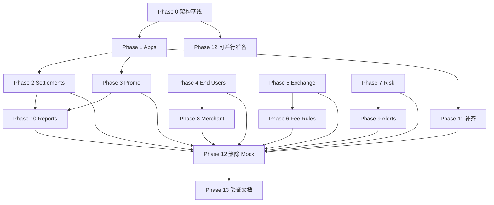

# 去除全部 Mock — 全量实施计划

> **For agentic workers:** REQUIRED SUB-SKILL: Use superpowers:subagent-driven-development (recommended) or superpowers:executing-plans to implement this plan task-by-task. Steps use checkbox (`- [ ]`) syntax for tracking.

**Goal:** 为管理端全部业务域补齐真实后端 API，前端各 View 自给数据，彻底删除 `USE_MOCK`、`mockData.ts` 及所有 Mock 分支，使 `VITE_USE_MOCK=false` 成为唯一运行模式。

**Architecture:** 按域增量交付——每个 Phase 完成后该域在真实 API 下可独立验收。后端沿用现有 FX 模块化单体模式（`handler → service → persistence`）；前端统一为 **View 自持 fetch + 局部 state**，`App.tsx` 仅保留壳层（鉴权、租户上下文、路由、全局 Modal）。权限从后端 `menuKeys` + 权限包推导，不再读取 `RBAC_ROLES`。

**Tech Stack:** Go 1.22+ / Gin / GORM / PostgreSQL / Redis / Uber FX；React 19 / Vite / react-i18next / Tailwind。

## Global Constraints

- **所有用户可见 UI 文案必须 i18n**（`AGENTS.md`）；禁止 TSX 硬编码中英文壳层字符串
- **鉴权 Cookie 会话**：响应 JSON 不得含 token；前端禁止读写 Cookie / localStorage 存 token；请求 `credentials: 'include'`
- **完成标准**：`npx tsc --noEmit` 通过；`go build ./...` 通过；对应域 API 有最小 handler 测试或 service 单测
- **分支命名**：`cursor/<descriptive-name>-332e`
- **每个 Phase 结束**：commit + push + 更新 PR

---

## 现状基线（2026-09-16）

| 类别 | 数量 |
|------|------|
| 已接后端、仍有 Mock 双路径 | 15 个 View + 11 个 API module |
| 纯 Mock、无后端 | 9 个域（apps/settlements/promo/end-users/exchange/fee/risk/merchant/alerts） |
| 前端 API 桩但后端 404 | `settlements.ts`、`apps.ts` |
| 未挂路由死代码 | `FinancialReportsView` |
| Mock 数据文件 | `mockData.ts`（3942 行）+ `emailTemplatesData.ts` 种子部分 |

---

## Phase 0 — 架构基线与权限统一

**目标：** 建立「去 Mock」后的前端数据流范式；消除 `RBAC_ROLES` 依赖。

### Task 0.1: 权限推导工具

**Files:**
- Create: `src/lib/permissions.ts`
- Modify: `src/lib/iamBootstrap.ts`
- Modify: `src/types/payment.ts`（可选：标注 `RbacRole.permissions` 由推导填充）

**Interfaces:**
- Produces: `deriveRolePermissions(menuKeys: string[], packKeys: string[]): RbacRole['permissions']`
- Produces: `useCurrentRole(user: SystemUser, roles: RbacRole[]): RbacRole`

**规则（从 menu key 映射）：**

| menu key | permission flag |
|----------|-----------------|
| `reconciliation` | `canTriggerReconciliation`, `canResolveDiscrepancy` |
| `dashboard` | `canViewExecutiveDashboard` |
| `financial_reports` | `canExportFinancialReports` |
| `tenants` | `canManageTenantSettings`, `canViewAllTenants` |
| `payment_channels` | `canManageChannels` |
| `payment_webhooks` | `canManageWebhooks` |
| `apps` | `canManageApps` |
| `system_users` | `canManageUsers` |
| `roles` / `permission_packs` | `canManageRbac` |
| `products` / `discounts` / `promo_campaigns` | 对应 `canManage*` |

- [ ] 实现 `deriveRolePermissions`，SUPER_ADMIN（`me.menuKeys` 含 `*` 或 roleKey=`SUPER_ADMIN`）全开
- [ ] `iamBootstrap` 映射 roles 时填充 `permissions`
- [ ] 替换 8 个组件中 `RBAC_ROLES[currentUser.roleKey]` → `useCurrentRole` 或 props 注入
- [ ] `npx tsc --noEmit`

### Task 0.2: 创建通用 View 数据 Hook 范式

**Files:**
- Create: `src/hooks/useAsyncData.ts`

```typescript
export function useAsyncData<T>(loader: () => Promise<T>, deps: unknown[]) {
  const [data, setData] = useState<T | null>(null);
  const [loading, setLoading] = useState(true);
  const [error, setError] = useState<Error | null>(null);
  const reload = useCallback(() => { /* fetch */ }, deps);
  useEffect(() => { void reload(); }, [reload]);
  return { data, loading, error, reload };
}
```

- [ ] 实现 hook（含 loading/error/reload）
- [ ] 在 `TransactionsView` 试点：删除 props `transactions`，内部 `transactionsApi.listTransactions`
- [ ] 验证页面在 `VITE_USE_MOCK=false` 下可加载

### Task 0.3: App.tsx 壳层瘦身（第一轮）

**Files:**
- Modify: `src/App.tsx`

**删除 state（改由 View 自持或 Context）：**
- `settlements`, `refunds`, `chargebacks`（已是死状态）
- `transactions`（Dashboard/Transactions/Reconciliation 改自持）
- `paymentWebhooks`, `emailWebhooks`（对应 View 已可自持）
- `isSimulating` 及 9 秒交易模拟器（整段删除）

**保留 state：**
- `currentUser`, `currentTenant`, `tenants`, `menus`, `rolesList`, `permissionPacks`, `departments`, `dictionary`
- 全局 Modal state（`activeDiscrepancyTx`, `quickCreateOpen` 等）

- [ ] 删除模拟器 `useEffect`
- [ ] 删除死 state 与 bootstrap 中对应 set
- [ ] 更新子组件 props 接口
- [ ] `npx tsc --noEmit`

---

## Phase 1 — 接入应用（Apps）

**目标：** `ApplicationManagementView` 走真实 `/apps` API。

### Task 1.1: 后端 Apps 域

**Files:**
- Create: `backend/internal/platform/app/module.go`
- Create: `backend/internal/platform/app/handler/app.go`
- Create: `backend/internal/platform/app/service/app.go`
- Modify: `backend/internal/infra/persistence/models.go`
- Modify: `backend/cmd/api/main.go`
- Modify: `backend/migrations/seed.go`（可选种子 1–2 条）

**Model `PaymentApp`:**

```go
type PaymentApp struct {
    ID          string `gorm:"type:uuid;primaryKey"`
    TenantID    string `gorm:"index;not null"`
    Name        string
    AppKey      string `gorm:"uniqueIndex"`
    AppSecret   string // 加密存储，列表脱敏
    ChannelIDs  string `gorm:"type:jsonb"` // []string
    Status      string // ACTIVE | DISABLED
    Environment string // live | sandbox
    CreatedAt   int64
    UpdatedAt   int64
}
```

**API:**
- `GET /api/v1/apps?tenantId=`
- `GET /api/v1/apps/:id`
- `POST /api/v1/apps`
- `PUT /api/v1/apps/:id`
- `DELETE /api/v1/apps/:id`
- `POST /api/v1/apps/:id/rotate-secret`

- [ ] GORM model + AutoMigrate
- [ ] Service CRUD + secret 轮换
- [ ] Handler + FX module 注册
- [ ] `go build ./...`

### Task 1.2: 前端 Apps 联调

**Files:**
- Modify: `src/api/modules/apps.ts`（删除 USE_MOCK）
- Modify: `src/components/ApplicationManagementView.tsx`
- Modify: `src/App.tsx`（移除 `paymentApps` state，View 自持）
- Modify: `src/locales/zh-CN/*.json`（Toast/空状态）

- [ ] View 内 `useAsyncData(appsApi.getApps)`
- [ ] 创建/编辑/禁用走 API
- [ ] 商品/折扣/渠道选择器从 `appsApi` + `channelsApi` 拉取
- [ ] 手工验证 `#/apps`

---

## Phase 2 — 结算出金（Settlements）

### Task 2.1: 后端 Settlements 域

**Files:**
- Create: `backend/internal/payment/service/settlement.go`
- Modify: `backend/internal/payment/handler/handler.go`
- Modify: `backend/internal/infra/persistence/models.go`

**Model `SettlementBatch`:**

```go
type SettlementBatch struct {
    ID            string
    TenantID      string
    Channel       string
    BatchDate     string // YYYY-MM-DD
    Currency      string
    GrossAmount   float64
    FeeAmount     float64
    NetAmount     float64
    TxCount       int
    Status        string // PENDING | PROCESSING | PAID | FAILED
    PayoutRef     string
    CreatedAt     int64
}
```

**API（对齐 `settlements.ts`）：**
- `GET /api/v1/settlements`
- `GET /api/v1/settlements/:id`
- `POST /api/v1/settlements/generate`（从 transactions 按日聚合，幂等）
- `POST /api/v1/settlements/payout`（`{ batchId, amount }`）

- [ ] 聚合逻辑复用 `reconciliation.go` 按日/渠道分组思路
- [ ] Handler 路由
- [ ] `go build ./...`

### Task 2.2: 前端 Settlements 去 Mock

**Files:**
- Modify: `src/api/modules/settlements.ts`
- Modify: `src/components/SettlementsView.tsx`

- [ ] 删除 USE_MOCK 分支
- [ ] 出金操作调 `createPayout`
- [ ] i18n 补错误 Toast

---

## Phase 3 — 促销邮件（Promo Campaigns）

### Task 3.1: 后端 Promo 域

**Files:**
- Create: `backend/internal/catalog/service/promo.go`
- Create: `backend/internal/catalog/handler/promo.go`（或扩展现有 handler）
- Modify: `backend/internal/infra/persistence/models.go`

**Model `PromoCampaign`:** 对齐 `src/types/payment.ts` 中 `PromoCampaign`（name, discountId, templateId, tenantId, schedule, status, stats）

**API:**
- `GET/POST/PUT/DELETE /api/v1/promo-campaigns`
- `POST /api/v1/promo-campaigns/:id/send`（记录发送任务；实际发送可异步）

### Task 3.2: 前端

**Files:**
- Create: `src/api/modules/promo.ts`
- Modify: `src/components/PromoCampaignsView.tsx`
- Modify: `src/App.tsx`（移除 `campaigns` state）
- Modify: `src/api/index.ts`

- [ ] 全 CRUD 走 API
- [ ] 关联折扣/模板下拉从 `discountsApi` / `messagingApi` 拉取

---

## Phase 4 — 终端客户（End Users）

### Task 4.1: 后端

**Files:**
- Create: `backend/internal/platform/customer/`（module/handler/service）
- Model: `EndUser`（tenantId, email, externalId, status, metadata jsonb）

**API:** `GET/POST/PUT/DELETE /api/v1/end-users`

### Task 4.2: 前端

**Files:**
- Create: `src/api/modules/endUsers.ts`
- Modify: `src/components/UserManagementView.tsx`
- Modify: `src/App.tsx`（移除 `endUsers` state）

---

## Phase 5 — 汇率（Exchange Rates）

### Task 5.1: 后端

**Files:**
- Create: `backend/internal/platform/treasury/service/rate.go`
- Model: `ExchangeRate`（baseCurrency, quoteCurrency, rate, source, effectiveAt）
- Model: `ExchangeRateHistory`（rateId, rate, recordedAt）— 替代前端 `genHistory()`

**API:**
- `GET/POST/PUT/DELETE /api/v1/exchange-rates`
- `GET /api/v1/exchange-rates/:id/history?range=30d`

### Task 5.2: 前端

**Files:**
- Create: `src/api/modules/exchangeRates.ts`
- Modify: `src/components/ExchangeRatesView.tsx`（删除 `genHistory()`）

---

## Phase 6 — 费率规则（Fee Rules）

### Task 6.1: 后端

**Model:** `FeeRule`（tenantId, channel, method, percentBps, fixedFee, currency, effectiveFrom）

**API:** `GET/POST/PUT/DELETE /api/v1/fee-rules`

### Task 6.2: 前端

**Files:**
- Create: `src/api/modules/feeRules.ts`
- Modify: `src/components/FeeRulesView.tsx`
- Modify: `src/App.tsx`（移除 `feeRules` state）

---

## Phase 7 — 风控规则 + 黑名单（Risk）

### Task 7.1: 后端

**Models:** `RiskRule`, `BlacklistEntry`

**API:**
- `GET/POST/PUT/DELETE /api/v1/risk-rules`
- `GET/POST/DELETE /api/v1/blacklist`
- `POST /api/v1/blacklist/import`（CSV，可选）

### Task 7.2: 前端

**Files:**
- Create: `src/api/modules/risk.ts`
- Modify: `src/components/RiskRulesView.tsx`
- Modify: `src/App.tsx`（移除 `riskRules`, `blacklist` state）

---

## Phase 8 — 商户 KYB 审核（Merchant Review）

### Task 8.1: 后端

**Model:** `MerchantApplication`（对齐 types：companyName, country, status, documents jsonb, reviewerId）

**API:**
- `GET /api/v1/merchant-applications`
- `GET /api/v1/merchant-applications/:id`
- `POST /api/v1/merchant-applications/:id/approve`
- `POST /api/v1/merchant-applications/:id/reject`

### Task 8.2: 前端

**Files:**
- Create: `src/api/modules/merchant.ts`
- Modify: `src/components/MerchantReviewView.tsx`

---

## Phase 9 — 告警（Alerts）

### Task 9.1: 后端

**Models:** `AlertRule`, `AlertHistory`

**API:**
- `GET/POST/PUT/DELETE /api/v1/alert-rules`
- `GET /api/v1/alert-history`
- `POST /api/v1/alert-rules/:id/toggle`

### Task 9.2: 前端

**Files:**
- Create: `src/api/modules/alerts.ts`
- Modify: `src/components/AlertsView.tsx`

### Task 9.3: 定时任务执行器（解除 50100）

**Files:**
- Modify: `backend/internal/platform/ops/service/task.go`
- Create: `backend/internal/platform/ops/executor/registry.go`

- [ ] 注册内置 job：`reconciliation.run`、`settlement.generate`、`alert.evaluate`
- [ ] `POST /scheduled-tasks/:id/trigger` 真实执行并写 `ScheduledTaskRun`
- [ ] `ScheduledTaskDetailView` 删除 mock 空态

---

## Phase 10 — 财务报表（Financial Reports）

### Task 10.1: 挂路由 + 后端聚合 API

**Files:**
- Modify: `src/App.tsx`（增加 `financial_reports` tab 路由）
- Modify: `src/data/mockData.ts` 中 `INITIAL_MENUS` 对应项（或 seed 已有）
- Create: `backend/internal/payment/service/report.go`

**API:**
- `GET /api/v1/reports/revenue?tenantId=&from=&to=`
- `GET /api/v1/reports/channel-breakdown`
- `GET /api/v1/reports/export`（CSV 流）

### Task 10.2: 前端

**Files:**
- Create: `src/api/modules/reports.ts`
- Modify: `src/components/FinancialReportsView.tsx`

---

## Phase 11 — 已有域补齐与修复

### Task 11.1: 折扣 Update API

**Files:**
- Modify: `backend/internal/catalog/service/discount.go`
- Modify: `backend/internal/catalog/handler/handler.go`
- Modify: `src/api/modules/discounts.ts`（加 `updateDiscount`）
- Modify: `src/components/DiscountsView.tsx`

- [ ] `PUT /api/v1/discounts/:id` + Creem 同步

### Task 11.2: Webhook 重投递真实化

**Files:**
- Modify: `backend/internal/payment/service/webhook.go`
- Modify: `src/components/PaymentWebhooksView.tsx`

- [ ] `POST /api/v1/payment-webhooks/:id/redeliver`
- [ ] 删除 `setTimeout` 客户端假 mutation

### Task 11.3: 邮件模板种子

**Files:**
- Modify: `backend/migrations/seed.go`

- [ ] 将 `REACT_EMAIL_PRESETS` 中核心模板写入 DB 种子（保留 `emailTemplatesData.ts` 仅作 preset 元数据，不含业务种子数组）

### Task 11.4: Dictionary 分类树去 Mock

**Files:**
- Modify: `src/components/DictionaryView.tsx`

- [ ] 删除 `mockCategoriesFromLabels()`；分类 CRUD 全走 `/dictionary/categories`

### Task 11.5: Audit / SystemConfig 去 Mock 回退

**Files:**
- Modify: `src/components/AuditLogsView.tsx`
- Modify: `src/components/SystemConfigView.tsx`

- [ ] 删除 `INITIAL_AUDIT_LOGS` / `INITIAL_SYSTEM_CONFIGS` / `INITIAL_SCHEDULED_TASKS` 回退
- [ ] 错误态显示空状态 + Toast，不静默降级 Mock

---

## Phase 12 — 全量剥离 Mock 层

### Task 12.1: API modules 清理（11 个文件）

**逐个删除：** `USE_MOCK`、`mockResolve`、`randomMockDelay`、`mockData` import

| 文件 | 动作 |
|------|------|
| `auth.ts` | 删除 fake login/register；logout 始终调 API |
| `tenants.ts` | 仅 http |
| `channels.ts` | 仅 http |
| `products.ts` | 仅 http |
| `discounts.ts` | 仅 http |
| `transactions.ts` | 仅 http |
| `refunds.ts` | 仅 http |
| `reconciliation.ts` | 仅 http |
| `settlements.ts` | 仅 http |
| `apps.ts` | 仅 http |
| `paymentWebhooks.ts` | 仅 http |
| `messaging.ts` | 仅 http |

- [ ] 全部清理完成
- [ ] `src/api/config.ts` 删除 `USE_MOCK`、`MOCK_DELAY`、`randomMockDelay`

### Task 12.2: lib 层清理

**Files:**
- Modify: `src/lib/auth.ts` — 删除 `mockLoggedIn`；`probeSession` 始终调 API
- Modify: `src/lib/iamBootstrap.ts` — 删除 `if (USE_MOCK) return null`
- Modify: `src/lib/iamActions.ts` — 删除所有 mock no-op 分支

### Task 12.3: 组件层清理

**对所有仍含 `USE_MOCK` 的 15 个组件：**
- 删除 `if (USE_MOCK)` 双路径
- 删除 props 型数据注入（`*` from App）
- 统一 `useAsyncData` + API

### Task 12.4: App.tsx 最终瘦身

**删除全部 `INITIAL_*` import 与 `useState(INITIAL_*)`**

**保留：**
```typescript
const [currentUser, setCurrentUser] = useState<SystemUser | null>(null);
const [currentTenant, setCurrentTenant] = useState<Tenant | null>(null);
const [tenants, setTenants] = useState<Tenant[]>([]);
// menus, roles, packs, departments, dictionary — 来自 bootstrap Context 或单次 loadShellIamData
```

- [ ] 创建 `src/context/ShellContext.tsx` 承载 IAM 壳层数据（可选但推荐）
- [ ] `QuickCreateModal` 模拟下单改为调 `POST /transactions/simulate` 或删除（产品决策：建议删除，用 Creem sandbox 真实事件）

### Task 12.5: 删除 Mock 文件

**Files:**
- Delete: `src/data/mockData.ts`
- Modify: `src/data/emailTemplatesData.ts` — 仅保留 `REACT_EMAIL_PRESETS`（UI 模板选择器）
- Modify: `.env.example` — 删除 `VITE_USE_MOCK`（或固定注释说明已废弃）

- [ ] 全仓库 `grep -r "mockData\|USE_MOCK\|INITIAL_" src/` 为零结果（`emailTemplatesData` preset 除外）

---

## Phase 13 — 验证与文档

### Task 13.1: 自动化验证

```bash
cd backend && go build ./... && go test ./...
cd .. && npx tsc --noEmit
# 可选：npm run build
```

### Task 13.2: 端到端验收清单

| # | 页面 | 验证项 |
|---|------|--------|
| 1 | 登录 | Cookie 会话 |
| 2 | 租户 | CRUD |
| 3 | 接入应用 | CRUD + secret 轮换 |
| 4 | 支付渠道 | Creem 探活 |
| 5 | 商品/折扣 | Creem 同步 |
| 6 | 交易流水 | Webhook 落库 |
| 7 | 对账/退款 | 引擎 + 核销 |
| 8 | 结算 | 批次生成 + 出金 |
| 9 | 促销 | CRUD |
| 10 | 终端客户 | CRUD |
| 11 | 汇率/费率/风控 | CRUD |
| 12 | 商户审核 | 审批流 |
| 13 | 告警 | 规则 + 历史 |
| 14 | 财务报表 | 聚合 + 导出 |
| 15 | 邮件/字典/IAM | 已有能力回归 |

### Task 13.3: 文档更新

**Files:**
- Create: `README.md`（根目录：启动、模块完成度表）
- Modify: `backend/README.md`（补 Phase 1–10 全部 API 表）
- Modify: `docs/backend-architecture.md` §15 演进路线勾选实际进度
- Modify: `AGENTS.md`（删除 Mock 相关说明，改为「必须后端可用」）

---

## 后端域模块规划总览

```
backend/internal/
├── platform/
│   ├── sys/          ✅ 已有
│   ├── dictionary/     ✅ 已有
│   ├── audit/          ✅ 已有
│   ├── ops/            ✅ 已有（Phase 9 补执行器）
│   ├── tenant/         ✅ 已有
│   ├── messaging/      ✅ 已有
│   ├── app/            🆕 Phase 1
│   ├── customer/       🆕 Phase 4
│   └── treasury/       🆕 Phase 5-6（rates + fees）
├── payment/            ✅ 已有（Phase 2 补 settlement，Phase 10 补 reports）
├── catalog/            ✅ 已有（Phase 3 补 promo，Phase 11 补 discount update）
└── risk/               🆕 Phase 7-8（risk + merchant + alerts 可合并为 platform/risk）
```

---

## 前端 API modules 目标清单

| 模块 | Phase |
|------|-------|
| `auth.ts`, `iam.ts` | 12（清理 mock） |
| `tenants.ts`, `channels.ts`, `products.ts`, `discounts.ts` | 12 |
| `transactions.ts`, `refunds.ts`, `reconciliation.ts`, `paymentWebhooks.ts` | 12 |
| `messaging.ts` | 12 |
| `apps.ts` | 1 |
| `settlements.ts` | 2 |
| `promo.ts` | 3 |
| `endUsers.ts` | 4 |
| `exchangeRates.ts` | 5 |
| `feeRules.ts` | 6 |
| `risk.ts` | 7 |
| `merchant.ts` | 8 |
| `alerts.ts` | 9 |
| `reports.ts` | 10 |

---

## 执行顺序与依赖



**可并行泳道：**
- 泳道 A：Phase 1 → 2 → 10（支付财务链）
- 泳道 B：Phase 4 → 8（用户/商户）
- 泳道 C：Phase 5 → 6（财务参数）
- 泳道 D：Phase 7 → 9（风控运维）
- 泳道 E：Phase 3（营销）
- 泳道 F：Phase 0 + 11 + 12（贯穿）

---

## 风险与决策点

| 决策 | 建议 | 原因 |
|------|------|------|
| QuickCreate 模拟下单 | **删除** | 与「零 Mock」目标冲突；用 Creem sandbox 产生真实流水 |
| `RBAC_ROLES` | **删除**，从 menuKeys 推导 | 后端已有 Casbin + 权限包 |
| `emailTemplatesData.ts` | **保留 PRESETS**，删除 INITIAL 种子 | Preset 是 UI 辅助，不是业务 Mock |
| Live/Sandbox 分桶 | Phase 11 或独立 Phase | 业务表加 `environment` 列 + 查询过滤 |
| E2E 测试框架 | Phase 13 可选 Playwright | 至少保证 tsc + go test |

---

## 完成定义（Done）

- [ ] `src/` 中无 `USE_MOCK`、`mockData` 引用
- [ ] `App.tsx` 无 `INITIAL_*` 种子 state
- [ ] 30 个路由 tab 在 `VITE_API_BASE_URL=/api/v1` 下可加载且 CRUD 可用
- [ ] `npx tsc --noEmit` && `go build ./...` 通过
- [ ] `backend/README.md` API 表与实现一致
- [ ] 新环境 `make run` + `npm run dev` 无需任何 Mock 配置即可完整演示
